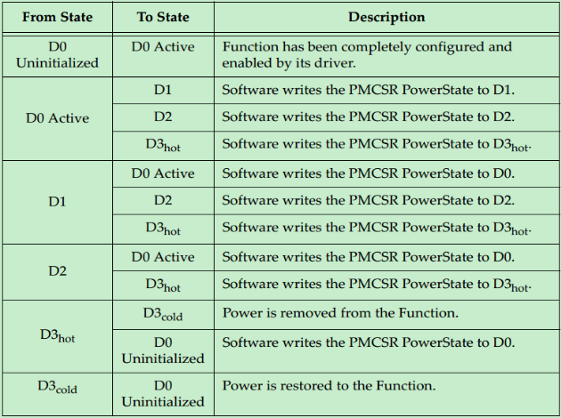

# PCIE Power管理
## 1、概要
PCIe总线定义的与功耗管理功能(Power Management, PM)相关的主要有：PCI-Compatible PM、Native PCIe Extensions、Bandwith Management和Event Timing Optimization。

其中，PCI-Compatible PM是一种在软件上和硬件上都与PCI-PM(定义在ACPI Spec中)兼容的模式，其要求PCIe设备的每个Function都包含PCI Power Management Capability寄存器。软件可以通过配置请求(Configuration Request)的方式来切换PCIe设备的某个Function的PM状态。在PCIe Spec V2.1中，还引入了动态功耗分配(Dynamic Power Allocation, DPA)的功能，具体请参考相关Spec，该模式并非本文介绍的重点。

本文介绍的重点为Native PCIe Extensions模式。该模式定义了一个基于硬件的，自发的链路功耗状态管理单元(Active State Power Management for the link, ASPM)，以及相关的唤醒机制。PCIe设备之间通过功耗管理事件(Power Management Event, PME)来进行相互通信，并控制功耗状态的切换。而功耗管理事件(PME)本质上是一种Message。

## 2、OSPM的各个功耗定义
ACPI(Advanced Configuration and Power Interface) Spec主要定义的是操作系统层面上的PM，在ACPI指定之前，各个厂商的设备之间的PM兼容性很差甚至是完全不兼容。而ACPI的出现，统一了操作系统层PM(即OSPM)的规范。OSPM的各个功耗状态定义如下图所示：

同时，也定义了PCIe设备的PM状态：

- D0状态，又被称为Full-On状态。其有两个子状态——D0(未初始化, Uninitialized)和D0(活动, Active)。

当PCIe设备刚完成Fundamental Reset时，或者刚从D3 Hot状态进入D0状态时，该PCIe设备的Function默认进入的是D0未初始化状态。在D0未初始化状态下，所有的寄存器(除了Sticky位)都恢复为其默认的状态。此时，只能响应配置请求(Configuration Transaction)，且不能发起事务，也不能处理接收到的Memory或者IO事务。

当处于D0未初始化状态的Function完成配置后，便会进入D0活动状态。在D0活动状态下，Function的所有功能都是可操作的，即正常工作的状态。

- D1状态，又称为轻睡眠状态(Light Sleep)。该状态是可选的，具体如下表所示：

- D2状态，又称为深睡眠状态(Deep Sleep)。该状态也是可选的，具体如下表所示：

- D3状态，又称为Full-Off状态。其也有两个子状态D3 Hot状态和D3 Cold状态。当设备进入D3 Hot状态，表明该设备的电源尚未切断；而进入D3 Cold状态，则表明设备的电源已被切断，如有Vaux存在，则链路进入L2状态，否则进入L3状态。D3 Hot的相关信息如下表所示：

软件层可以通过向PMCSR(Power Mgt Control and Status Register)的PowerState位置写相关值使得设备的某个Function进入D3 Hot状态。在D3 Hot状态下，该Function只能放PME消息和PME_TO_ACK消息或者应答配置请求和PME_Turn_Off消息。

在进入D3状态之前，软件必须保证所有重要的Non-Posted的请求都收到了与之匹配的Completion。这可以通过配置空间中的设备状态寄存器的相关位来查询。如果由于设备目标PCIe设备故障，导致其长时间内无法接收到Completion，则软件必须要等待足够长的时间再执行进入D3操作。当Function进入D3 Hot状态后，链路则会强制进入L1状态。此时Function的内容(寄存器中的数据等)将会丢失，但是PCIe设备必须要保证PME的相关内容不受影响，这样才能在D3 Hot状态下产生PME消息。

> 注：虽然是对PCIe设备的某一个Function进行的PM操作，但是PM操作会影响到电源状态和链路状态，进而影响到同一个设备的其他Function(如果是Multi-Function设备的话)

当PCIE设备的电源被断开后，则自动从D3 Hot状态进入D3 Cold状态。在D3 Hot的情况下，软件可以向Function的PMCSR中的PowerState位置写入相关内容，使得Function从D3 Hot状态切换为D0未初始化状态。此后，可能还需要一次复位操作，才能使得该Function进入D0活动状态。

当PCIe设备的电源被恢复后，则必须要进行一次复位操作，才能使得其从D3 Cold状态回到D0状态。相关信息如下表所示：

## 3、PCIe设备PM的各个状态关系
具体的切换关系如下图所示：

具体信息如下表所示：

## 4、PCIe的五种链路状态
- L0是Fully Active状态。
- L0s，低功耗模式，仅支持ASPM方式，是硬件自动发起的，软件无法控制，是单向的，比如upstream有大量数据，downstream没有数据的时候downstream可以独立的进入L0s。
- L1，低功耗模式，支持两种方式PCI-PM，ASPM；L1子状态可以关闭参考时钟、Tx common mode电路，Rx electric idle detect电路更加省电。
- L2，低功耗模式，仅支持PCI-PM方式，关闭参考时钟、关闭PLL、关闭Main Power，但是需要保留Aux Power。
- L3，低功耗模式，仅支持PCI-PM方式，处于所有power都off的状态。
- 按照省电的顺序L0<L0s<L1<L2<L3，越省电的状态recovery到L0正常工作状态的时间就会越长。
  
## 5、电源状态和链路状态的对应关系

- D0状态下可以对应L0，L0s，L1；
- D1、D2、D3hot对应的链路状态是L1；
- D3cold对应的链路状态是L2，L3；