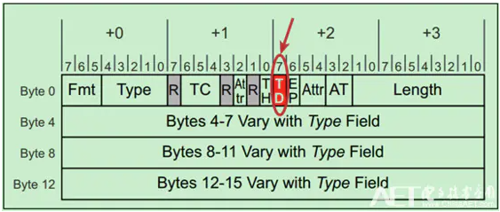

# PCIe-ECRC校验错误
ECRC是可选的，主要用于包含有Switch的PCIe总线系统中。且只有支持AER的PCIe设备才有能力支持ECRC功能。配置软件通过检查配置空间，确认PCIe设备的某个功能(Function)支持ECRC后，可以通过向错误功能控制寄存器(Error Capability and Control Register)中的响应为写0或者1来禁止或者使能ECRC功能。

如果使能了ECRC功能，可以通过TLP包头中的TD(TLP Digest, ECRC也被称为Digest)为来标记当前的TLP是否使用ECRC，如下图所示。

> 注：如果TD为1(表示使用ECRC)，但是TLP中却没有ECRC；或者TD为0，TLP中却包含了ECRC，则会被判定为TLP格式错误，即Malformed TLP错误。

ECRC是基于TLP的包头和数据(Header and Data Payload)计算的，接收端会重新基于这些内容计算并收到的TLP中的ECRC作对比，如果结果不一致，则认为数据传输过程中发生了问题，数据被破坏了，进而产生ECRC校验错误。

> 注：在TLP包头中，有两位实际上是不参与ECRC计算的——Type域的bit0和EP位。这两位通常被称为Variant bits,且在ECRC计算的时候，这两位的对应位置始终被认为是1，而非使用实际的数值。

当接收端接收到的请求TLP中存在ECRC校验错误时，接收端通常会选择不对该请求发送TLP(Completion)，并将ECRC错误状态位(配置空间中的)置位。发送端由于长时间未接收到Completion，进而会产生Completion超时错误(Timeout Error)。而大部分发送端，会选择重新发送先前的请求Request。

当发送端(Requester)在发送完请求后收到了来自接收端返回的TLP(Completion)时，却发现该Completion TLP中存在ECRC校验错误，会将ECRC错误状态位(配置空间中的)置位。发送端可以选择重新发送先前的请求Request，还可以选择通过特殊功能中断(Function Specific Interrupt)向系统报告错误。