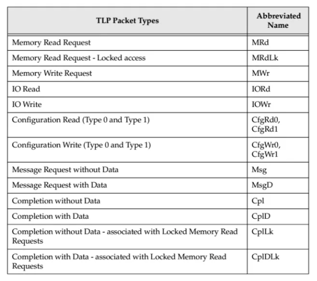

# TLP类型介绍
从PCIE的拓扑结构可以看出PCIE设备是以peer-to-peer结构连接在一起的，并且点到点之间是以**数据包**的形式传输的。

PCIE在逻辑上分为三层，分别是：
1.  **TL**层，对应数据包为**TLP**
2.  **数据链层(Data Link Layer)**，对应数据包为**DLLP**
3.  **物理层(PHY Layer)**，对应数据包为**PLP**
>DLLP和PLP只会在相邻的两个设备之间传递，不会传递给第三个设备。

TLP主要可以分为以下四类：
1. 与memory有关
2. 与IO有关
3. 与配置(configuration)有关
4. 与消息(message)有关

>configuration TLP是用来对PCIE设备进行配置专用的数据包，例如可以修改设备寄存器的值。

详细如下图所示：

同时我们还可以从数据包由发送方发送到接收方之后接收方是否返回一个数据包，将TLP分为两类：
1. **Posted接收方不返回数据包**
2. **Non_posted**接收方返回数据包
数据包相应的对应关系如下图所示：

TLP四种类型的差异主要在**TLP Header中**， TLP Header有两种格式，一种长度为3DW，一种为4DW。在TLP Header的Byte 0中有Fmt和Type两个部分，他们一起来表示TLP的类型。不同的类型长度不一样，如下图所示：

