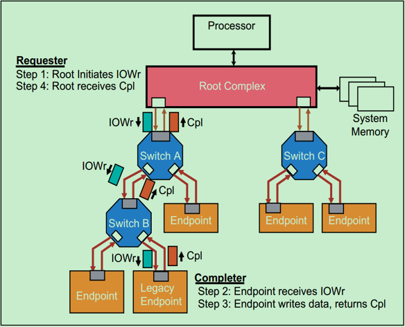
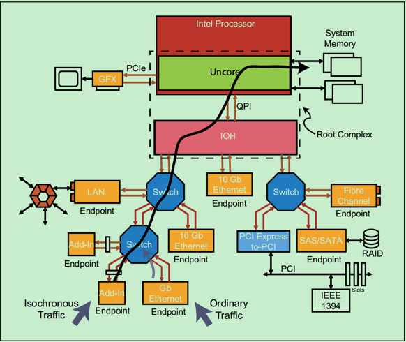

# PCIE概念简介
1. PCIE的通常结构

2. 一个完整的PCIE体系包括应用层、事务层(Transaction Layer)、数据链路层(Data Link Layer)和物理层(Physical Layer)。其中，应用层并不是PCIE Spec所规定的内容，完全由用户根据自己的需求进行设计，另外三层都是PCIE Spec明确规范的，并要求设计者严格遵循。

- 应用层或者软件层：

 这一层决定了PCIE设备的类型和基础功能，可以由硬件(如FPGA)或者软硬件协同实现。如果该设备为Endpoint，则其最多可拥有8项功能(Function)，且每项功能都有一个对应的配置空间(Configuration Space)。如果该设备为Switch，则应用层需要实现包路由(Packet Routing)等相关逻辑。如果该设备为Root，则应用层需要实现虚拟的PCIE总线0(Virtual PCIE Bus 0)，并代表整个PCIE总线系统与CPU通讯。
- 事务层(Transaction Layer)：

 接收端的事务层负责事务层包(Transaction Layer Packet, TLP)的解码与校验，发送端的事务层负责TLP的创建。此外，事务层还有QoS(Quality of Service)和流量控制(Flow Control)以及Transaction Ordering等功能。
- 数据链路层(Data Link Layer)：

数据链路层负责数据链路层包(Data Link Layer Packet, DLLP)的创建，解码和校验。同时，本层还实现了Ack/Nak的应答机制。
- 物理层(Physical Layer)：

物理层负责Ordered-Set Packet的创建和解码。同时负责发送与接收所有类型的包(TLPs、DLLPs和Ordered-Sets)。当前在发送之前，还需要对包进行一些列的处理，如Byte Striping、Scramble(扰码)和Encoder(8b/10b for Gen1&Gen2,128b/130b for Gen3&Gen4)。对应的，在接收端就需要进行相反的处理。此外，物理层还实现了链路训练(Link Training)和链路初始化(Link Initialization)的功能，这一般是通过链路训练状态机(Link Training and Status State Machine, LTSSM)来完成的。

关于事务层，数据链路层和物理层的详细的功能图标如下图所示：

3. 在PCIE Spec中，规定了四种类型的请求(Request) : Memory、IO、Configuration和Messages。其中，前三种都是从PCI/PCI-X总线中继承过来的，第四种Messages是PCIE新增加的类型。
   

从表中我们可以发现，只有Memory Write和Message是Posted类型的，其他的都是Non-Posted类型的。所谓Non-posted，就是Requester发送了一个包含Request的包之后，必须要得到一个包含Completion的包的应答，这次传输才算结束，否则会进行等待。所谓Posted，就是Requester的请求并不需要Completer通过发送包含Completion的包进行应答，当然也就不需要进行等待了。很显然，Posted类型的操作对总线的利用率要远高于Non-Posted型。

>那么为什么要分Non-Posted和Posted两种类型呢？
>
>对于Memory Writes来说，对效率要求较高，因此采用了Posted的方式，但是这并不意味这Posted类型的操作完全不需要Completer进行应答，Completer仍然可采用另一种应答机制——Ack/Nak的机制(在数据链路层实现的)。

4. PCIe的TLP包共有以下几种类型：
   

以下是几种TLP访问的例子:
- Non-Posted Transaction-Ordinary Reads

下图显示的是一个Endpoint向System Memory发送读请求(Read Request)的例子

Endpoint的读请求通过了两个Switch，然后到达其目标，即Root。Root对读请求的包进行解码后，并从中识别出操作的地址，然后锁存数据，并将数据发送至Endpoint，即包含数据的Completion包，ClpD。需要注意的是，PCIe允许每个包的最大数据量(Max Data Payload)为4KB，但实际上设计者往往会采用较小的Max Payload Size(比如128,256,512,1024)。因此，常常一个读请求会对应多个ClpD，即将大于Max Payload Size的数据分成多个包发送。如果遇到错误，Root会通过Completion包告知相应的Endpoint。
- Non-Posted Transaction-Locked Reads

下图显示的是一个简单的Locked Read请求操作：

请求者(Requester)请求一个操作，数据包是MRdLk.当接受者(Completer)接受之后，完成响应操作，之后返回一个数据包，可能是CplDLk或者CplLk。在Requester接受到Completion之前，数据包传递路径锁定。
>Locked请求实际上是PCIe为了兼容早期的PCI总线而设置的一种方式，对于非PCI兼容的设计中，是不允许使用Locked操作的。并且也只有Root可以发起Locked请求操作，Endpoint是不可以发起Locked请求操作的。
>
>Locked Read主要用于支持一种叫做Atomic Read-Modify-Write操作，这是一种高优先级且不可被打断的操作。主要用于测试链路状况等任务(针对PCI设备，PCIe设备禁止使用Locked操作)。此外，Locked操作采用的是目标存储寻址(Target Memory Address)来寻找Legacy Endpoint(PCI设备)。
- Non--Posted Transaction-IO/Configuration Writes

下图是一个Non-Posted IO写操作的例子：

和Locked操作一样，IO操作也是为了兼容早期的PCI设备，在PCIe设备中也是不建议使用。
- Posted Writes-Memory Writes
  

PCIe中的Memory写操作都是Posted的，因此Requester并不需要来自Completer的Completion。
>当发生错误时，Requester不会知道。但是，此时Completer会将错误记录到日志，然后向Root发送包含错误信息的Message。

5. 为了保证音频和视频等需要高优先级的特殊应用的数据包能够得到优先发送，PCIe Spec中为每一个包都分配了一个优先级，通过TLP的Header中的3位(即TC,Traffice Clss)。如下图所示：
   

TC值越大，表示优先级越高，对应的包也就会得到优先发送。一般来说，支持QoS(Quality of Service)的PCIe总线系统，对于每一个TC值都会有一个独立Virtual Channel(VC)与之对应。这个Virtual Channel实际上就是一个Buffer，用于缓存数据包。
>当然也有那些只有一个VC Buffer的，此时不管包的TC值如何，都只能缓存同一个VC Buffer中，自然也就没有办法保证按优先级传输了。这样PCIe设备称之为不支持QoS的PCIe设备。

一个简单的QoS例子如下图所示：

图中左下角的Endpoint(即Isochronous Traffic)的优先级比右边的Endpoint(即Ordinary Traffic)的优先级要高。因此，在Switch中，来自左边的Endpoint的包会得到优先传输。而Switch的这种判决操作叫做端口仲裁(Port Arbitration)。

6. Flow Control的概念

对于大部分的串行传输协议而言，发送方能够有效地将数据发送至接收方的前提是，接收方有足够的接收Buffer来接收数据。在PCI总线中，发送方在发送前并不知道接收方是否有足够的Buffer来接收数据(即接收方是否就绪)，因此经常需要一些Disconnects和Retries的操作，这将会严重地影响到总线的传输效率。

PCIe总线为了解决这一问题，提出了Flow Control的概念，如图所示。PCIe总线中要求接收方必须经常向发送方报告其VC Buffer的使用情况。而报告的方式是，接收方向发送方发送Flow Control的DLLP(数据链路层包)，且这种DLLP的收发室由硬件层面上自动完成的，并不需要人为的干预。需要注意的是，虽然这一操作旨在数据链路层之间进行，但是这些VC Buffer的使用情况对于应用层也是可见的。

